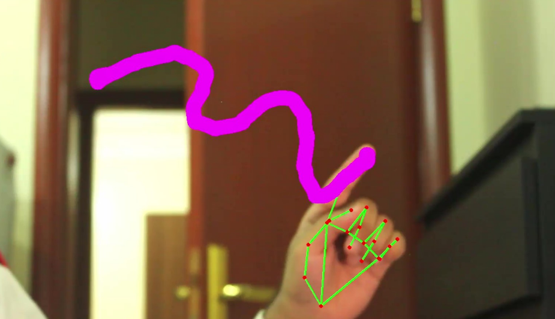

# Real-time Hand Gesture Drawing with OpenCV and MediaPipe

This project utilizes OpenCV and MediaPipe's hand tracking capabilities to create a real-time hand gesture drawing application. The user can draw on the screen by moving their index finger, and erase the drawing by raising their index and middle fingers simultaneously.

